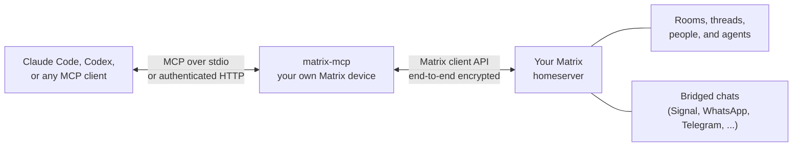

<div class="mm-hero" markdown>


# Matrix MCP

<p class="mm-tagline">Give your AI agent a seat in every Matrix room.</p>

<p class="mm-lede">
A full-featured MCP server for Matrix.
Claude Code, Codex, and any other MCP client can catch up on your rooms, search and read threads, reply, react, share files, and run rooms, including end-to-end encrypted ones.
</p>

[:lucide-rocket: Get started](getting-started.md){ .md-button .md-button--primary }
[:lucide-wrench: Browse the 43 tools](usage.md){ .md-button }
[:fontawesome-brands-github: GitHub](https://github.com/mindroom-ai/matrix-mcp){ .md-button }

</div>

## Up and Running in a Minute

```bash
uv tool install matrix-mcp                 # install
matrix-mcp auth sso https://mindroom.chat  # log in through your browser
claude mcp add matrix -- matrix-mcp serve  # or: codex mcp add matrix -- matrix-mcp serve
```

Then ask your agent something like *"What did I miss in the release room?"*
The server talks to your MCP client over stdio and opens no local port.

## What You Can Ask

<div class="grid cards mm-prompts" markdown>

-   "Catch me up: which rooms need me, and what was I mentioned in?"

    ---

    `matrix_get_unread` · `matrix_read_thread`

-   "Which threads in #dev are still active? Reply to the deploy one with my fix."

    ---

    `matrix_list_threads` · `matrix_send_message`

-   "Did anyone 👍 my proposal, and has Bob read it yet?"

    ---

    `matrix_get_reactions` · `matrix_get_read_receipts`

-   "DM Bob the coverage report from this repo."

    ---

    `matrix_create_dm` · `matrix_send_message` with `file_path`

-   "Download the screenshot Alice posted and tell me what's broken."

    ---

    `matrix_read_room_recent` · `matrix_download_media`

-   "Find where we picked the release date and show me the discussion around it."

    ---

    `matrix_search_messages` · `matrix_get_event_context`

</div>

## Why Matrix MCP

As far as we know, Matrix MCP is the only Matrix MCP server that runs both as a local server with end-to-end encryption and as a multi-user hosted service where everyone signs in with their own Matrix account.

<div class="grid cards" markdown>

-   :lucide-wrench:{ .lg } **The whole client, not a demo**

    ---

    43 tools cover search, threads, history, unread catch-up, reactions, read receipts, replies, edits, direct chats, spaces, pins, moderation, profiles, and media.

    [:lucide-arrow-right: Tool reference](usage.md)

-   :lucide-lock:{ .lg } **End-to-end encryption**

    ---

    Matrix MCP is its own Matrix device.
    Encrypted rooms just work: reads are decrypted, sends and files are encrypted, and older keys import from Element.

    [:lucide-arrow-right: Encryption](encryption.md)

-   :lucide-key-round:{ .lg } **Log in the way your server allows**

    ---

    Matrix SSO in the browser, even over SSH or on a headless box, plus password, login-token, and access-token login.
    Works behind Cloudflare Access and other gateways.

    [:lucide-arrow-right: Getting started](getting-started.md)

-   :lucide-globe:{ .lg } **Local by default, hosted when you want it**

    ---

    stdio for local agents, with no open ports.
    Or run authenticated HTTP, where every user signs in with their own Matrix account through OAuth and Matrix SSO.

    [:lucide-arrow-right: Authenticated HTTP](hosted.md)

-   :lucide-hash:{ .lg } **Friendly to the context window**

    ---

    Rooms and events get short, stable numeric refs, so an agent writes `room_id=3, thread_id=42` instead of copying long Matrix IDs back and forth.

    [:lucide-arrow-right: Numeric refs](usage.md#numeric-refs)

-   :lucide-shield-check:{ .lg } **Careful by design**

    ---

    Every tool says whether it reads, writes, or destroys.
    Reading never marks messages read, receipts are private by default, transfers are size-bounded, and it refuses to kick, ban, or demote you.

    [:lucide-arrow-right: Safety notes](usage.md#safety)

</div>

## How It Works



Matrix MCP acts as a regular Matrix client signed in as you.
Your agent sees exactly the rooms your account has joined, with your account's permissions, and nothing more.
If your homeserver bridges other networks, those chats are Matrix rooms too.

Running it locally lets a coding agent read Matrix context, reply in threads, and attach files from your machine, without giving a hosted agent access to your filesystem.

## The Tool Set

| Area | Tools |
| --- | --- |
| [Session and rooms](usage.md#session-and-rooms) | `matrix_whoami`, `matrix_list_rooms`, `matrix_get_room_info`, `matrix_set_room_name`, `matrix_set_room_topic`, `matrix_set_room_avatar`, `matrix_get_space_hierarchy` |
| [Reading](usage.md#reading) | `matrix_read_room_recent`, `matrix_read_thread`, `matrix_list_threads`, `matrix_read_history`, `matrix_get_event_context`, `matrix_search_messages`, `matrix_get_reactions`, `matrix_get_read_receipts` |
| [Writing](usage.md#writing) | `matrix_send_message`, `matrix_reply`, `matrix_react`, `matrix_edit_message`, `matrix_redact_event`, `matrix_pin_message`, `matrix_unpin_message` |
| [Membership](usage.md#membership) | `matrix_list_room_members`, `matrix_search_users`, `matrix_invite_user`, `matrix_list_invitations`, `matrix_join_room`, `matrix_leave_room`, `matrix_create_room`, `matrix_create_dm` |
| [Moderation](usage.md#moderation) | `matrix_get_power_levels`, `matrix_set_power_level`, `matrix_kick_user`, `matrix_ban_user`, `matrix_unban_user` |
| [Profile](usage.md#profiles) | `matrix_get_profile`, `matrix_set_display_name`, `matrix_set_avatar` |
| [Media](usage.md#media) | `matrix_upload_media`, `matrix_download_media`, `matrix_send_media` |
| [Catch-up](usage.md#unread-catch-up) | `matrix_get_unread`, `matrix_mark_read` |

<div class="mm-mindroom" markdown>


<div markdown>

**Built by [MindRoom](https://mindroom.chat)**

MindRoom builds open-source AI agents that live in Matrix.
We use Matrix MCP to bring our local coding agents into the same rooms as our teammates and our MindRoom agents.
It works with any Matrix homeserver, no MindRoom account needed.

</div>

</div>
